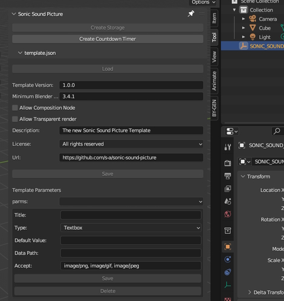
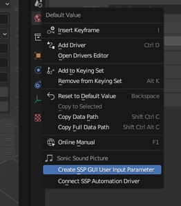

# Easy Sonic Sound Picture (SSP) Blender Addon

If you're looking to create stunning and immersive audio visualizations, [Sonic Sound Picture](https://github.com/s-a/sonic-sound-picture) is the perfect tool for you. And now, with "easy-ssp", you can easily create a custom template to jumpstart your creativity and streamline your workflow.

[Easy SSP](https://github.com/s-a/easy-ssp/releases) includes a range of tools and utilities that will help you get started with [SSP](https://github.com/s-a/sonic-sound-picture) templates in no time. From setting up the correct project settings to custom shapes and animations, "easy-ssp" has got you covered 🙃.

**Notes**: *The panel options stay disabled until the current **.blend file is saved** and a `SONIC_SOUND_PICTURE_DATA_STORAGE` was created.*

- [Detailed information about audio signal visualization processing inside Sonic Sound Picture Software](https://github.com/s-a/sonic-sound-picture#create-new-templates) 
- [Download Addon](https://github.com/s-a/easy-ssp/releases)