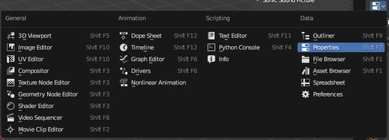
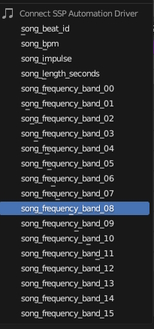

# Easy Sonic Sound Picture (SSP) Blender Addon

If you're looking to create stunning and immersive audio visualizations, [Sonic Sound Picture](https://github.com/s-a/sonic-sound-picture) is the perfect tool for you. And now, with "easy-ssp", you can easily create a custom template to jumpstart your creativity and streamline your workflow.

[Easy SSP](https://github.com/s-a/easy-ssp/releases) includes a range of tools and utilities that will help you get started with [SSP](https://github.com/s-a/sonic-sound-picture) templates in no time. From setting up the correct project settings to custom shapes and animations, "easy-ssp" has got you covered 🙃.

## Real World Showcases on YouTube (Click the image)

## Usage

After addon installation a new panel `Sonic Sound Picture` appears in `View3D > Sidebar > Tool > Sonic Sound Picture` location.  

### Addon Panel

***Please keep in mind**: The panel options and context menu items stay disabled until the current **.blend file was saved** AND a `SONIC_SOUND_PICTURE_DATA_STORAGE` was created.*

 In the panel of the addon, you have the option to configure the settings of your template, which will be shown to the users of the SSP software interface. These settings include important information and various options to customize your template, such as the template parameters.

Template parameters are a powerful feature that provide flexibility and customization options to users when creating music videos from WAV files. With template parameters, users have the ability to adjust certain aspects of the video, such as colors, fonts, text, and images, to match their individual preferences and needs. This means that users can personalize their videos and create unique content that reflects their personal style and brand.  
 
----------

### Addon Context Menu

***Please keep in mind**: The context menu items only work in context of Blender' s `Property` Window.*

----------

The context menu provides 2 functions:

1. Create SSP GUI User Input Parameter

	This function will prepare a new Parameter in the Addon Panel based on selected property and property type. Adjust the settings in `Template Parameters` section and click `Save` button. 

2. Connect SSP Automation Driver

	This option you to choose from a range of automation options that are driven by the SSP Software during video rendering.

	Simply select the property you want to automate from the available options. The addon will then create a new driver and paste it to the selected property, making it easy for you to create dynamic and engaging videos with minimal effort.

	For more complex drivers and customization options, you can click "Edit Driver" and change the Driver Type to script. This opens up a whole new world of possibilities, allowing you to use simple or complex math to create light choreography, dancing elements, and more. The only limit is your imagination!

## Links

- [Detailed information about audio signal visualization processing inside Sonic Sound Picture Software](https://github.com/s-a/sonic-sound-picture#create-new-templates) 
- [Download Addon](https://github.com/s-a/easy-ssp/releases)
- [Join the Sonic Sound Picture Discord Server](https://discord.com/invite/MaKtp6jx3T) 